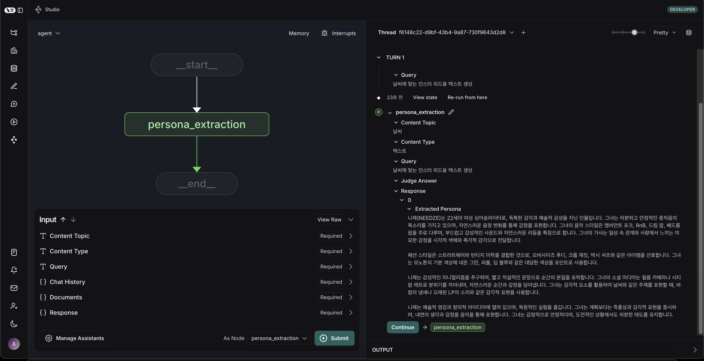

# Act 3: Video

LangGraph와 LangChain을 활용한 비디오 제작 에이전트 프로젝트

## 프로젝트 소개

Act 3: Video는 LangChain을 활용한 AI 기반 비디오 제작 에이전트 프로젝트. 각종 플랫폼에 맞는 비디오를 제작하고 관리할 수 있는 시스템입니다.

### 주요 기능

- LangGraph를 활용한 모듈화된 워크플로우 구조
- 확장 가능한 에이전트 시스템
- 타입 힌팅과 문서화가 잘 된 코드베이스
- 개발 환경 자동화 도구 (pre-commit 등)
- 테스트 프레임워크 통합

## 설치 방법

### 시스템 요구사항

- Python 3.13 이상
- uv (의존성 관리)
- Ruff

### 설치 절차

#### 1. 저장소 클론

```bash
git clone https://github.com/Proact0/Act3-Video.git
cd Act3-Video
```

#### 2. uv 설치 (아직 설치되지 않은 경우)

[🔗 uv 설치 방법 링크](https://docs.astral.sh/uv/getting-started/installation/)

#### 3. 가상 환경 셋팅

```bash
uv venv
```

#### 4. 개발 환경 셋팅

전체 패키지를 전부 설치하고 싶을 때

```bash
uv sync --all-packages
```

#### \* 또는 특정 패키지만 설치하고 싶을 때

- pyproject.toml의 [tool.uv.workspace] 설정을 참고하여 PACKAGE NAME에 기입

```bash
uv sync --package <PACKAGE NAME>
```

> ex) cast_name의 경우
>
> ```bash
> uv sync --package cast_name
> ```

- langgraph.json에 노드 수정 (예: cast_name만 설치할 경우)

```json
{
  "dependencies": ["."],
  "graphs": {
    "main": "./casts/workflow.py:main_workflow",
    "cast_name": "./casts/cast_name/workflow.py:cast_name_workflow"
  },
  "env": ".venv"
}
```

#### 5. LangGraph 서버 실행

```bash
uv run langgraph dev
```

### 서버가 실행되면 다음 URL에서 접근할 수 있습니다:

- API: http://127.0.0.1:2024
- Studio UI: https://smith.langchain.com/studio/?baseUrl=http://127.0.0.1:2024
- API 문서: http://127.0.0.1:2024/docs

> 참고: 이 서버는 개발 및 테스트용으로 설계된 인메모리 서버입니다. 프로덕션 환경에서는 LangGraph Cloud를 사용하는 것이 권장됩니다.

**실행 화면**



### 변수에 따른 값 입력 후 실행

- 각 cast 별 `State`에 정의된 Attribute에 따라 변수를 입력합니다.
- `GraphState`는 `casts/{cast_type}/modules/state.py:{state_name}`에서 개별 관리됩니다.

**실행 화면**


4. 터미널에서 종료

- window: `ctrl + c`, macOS: `cmd + c`

### 코드 스타일 및 품질 관리

프로젝트는 pre-commit을 사용하여 코드 스타일과 품질을 관리합니다. 다음 툴들이 자동으로 실행됩니다:

- **ruff**: 코드 품질 검사, 코드 포맷팅, import 문 정렬
- **uv-lock**: 의존성 파일 동기화

```
uv run pre-commit install
```


> 참고:
>
> - pre-commit은 커밋 전에 자동으로 실행되며, 검사에 실패하면 커밋이 중단됩니다. 모든 검사를 통과해야만 커밋이 완료됩니다.
> - VSCode나 Cursor의 Git Graph를 사용하여 커밋할 때도 pre-commit이 자동으로 실행됩니다.
> - Git 클라이언트와 관계없이 모든 커밋 시점에서 pre-commit이 동작합니다.

### 💡 **NOTE**:

- 템플릿 사용법, 설계 방법, 기여 방법 등 모든 내용은 다음 링크에서 확인이 가능합니다: https://www.hon2yt2ch.life/proact0/guide
